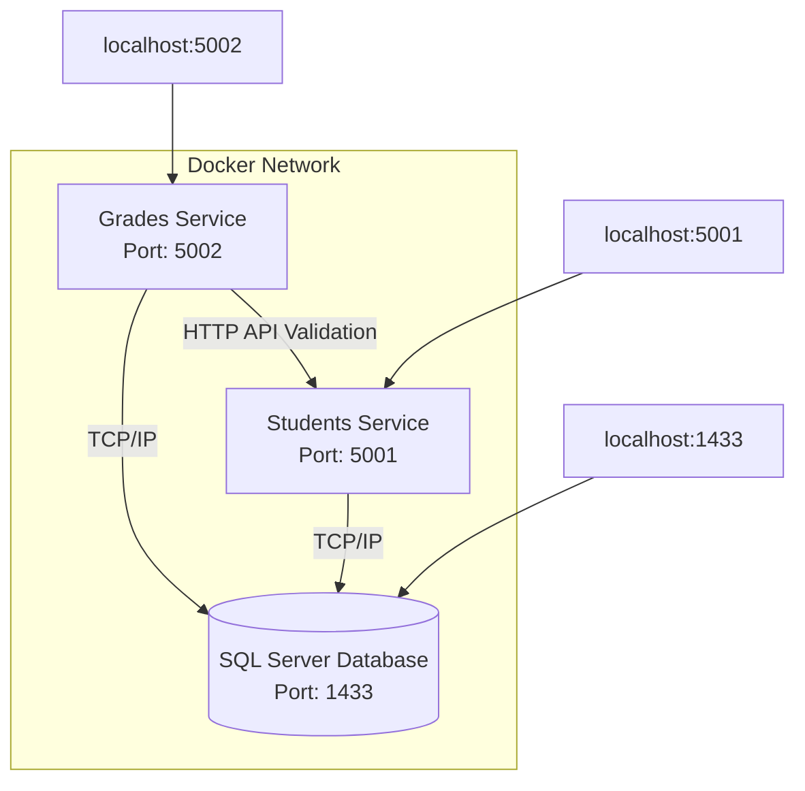
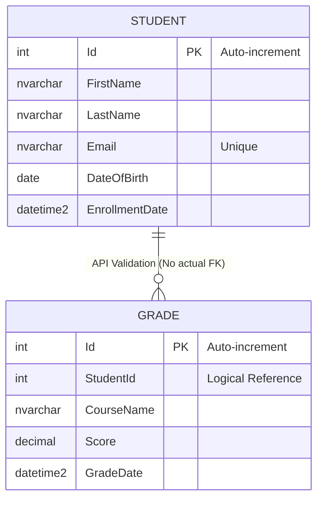
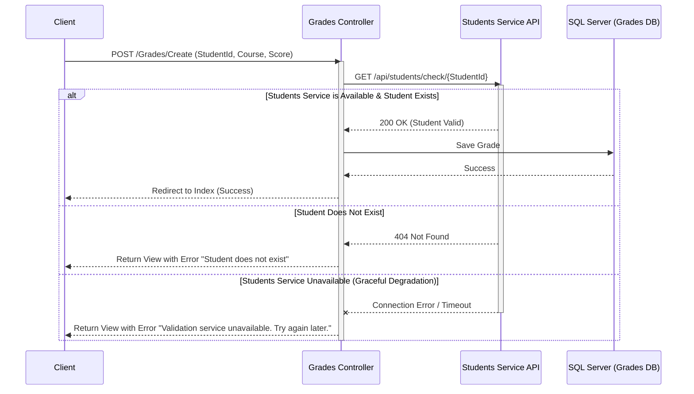
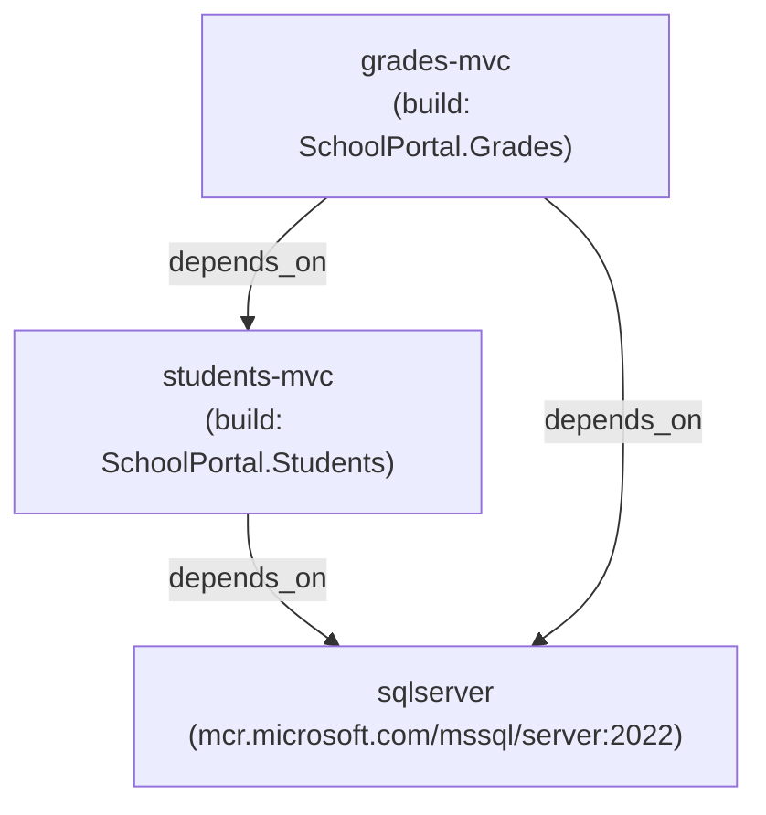

# SchoolPortal - Microservices Architecture


A modern, containerized school management system built with ASP.NET Core 10.0, featuring a microservices architecture with two independent services for managing students and grades.

## 📑 Table of Contents

- [Architecture Overview](#️-architecture-overview)
- [Project Highlights](#-project-highlights)
- [Screenshots](#-screenshots)
- [Features](#-features)
- [Technology Stack](#️-technology-stack)
- [Project Structure](#-project-structure)
- [Getting Started](#-getting-started)
- [Configuration](#-configuration)
- [Database Schema](#-database-schema)
- [API Endpoints](#-api-endpoints)
- [Request Flow](#-request-flow)
- [Docker Details](#-docker-details)
- [Testing the Application](#-testing-the-application)
- [Application Screenshots](#-application-screenshots)
- [Development](#️-development)
- [Troubleshooting](#-troubleshooting)

## 🏗️ Architecture Overview

SchoolPortal consists of two microservices that communicate over HTTP:

- **Students Service**: Manages student information and profiles
- **Grades Service**: Manages academic grades and validates students via the Students Service API
- **SQL Server**: Shared database server with automatic migrations



## ✨ Project Highlights

This project demonstrates:

- ✅ **Microservices Architecture**: Two independent services communicating via HTTP APIs
- ✅ **Docker Containerization**: Multi-stage builds with optimized images
- ✅ **Service Orchestration**: Docker Compose managing multiple containers
- ✅ **Inter-Service Communication**: HTTP client for service-to-service validation
- ✅ **Database Automation**: Automatic migrations on container startup
- ✅ **Modern UI/UX**: Responsive design with Tailwind CSS and neon theme
- ✅ **RESTful APIs**: Clean API endpoints for data access
- ✅ **Error Handling**: Graceful degradation and custom exception handlers
- ✅ **Data Persistence**: SQL Server with persistent volumes
- ✅ **Central Package Management**: Consistent dependency versions across services

> **See the application in action**: Check out the [Screenshots](#-screenshots) section below!

## 📸 Screenshots

### Students Service

*Students Service landing page with modern neon-themed design*


*Student management interface with CRUD operations*

### Grades Service

*Grades Service interface for managing academic records*

## 📋 Features

### Students Service
- ✅ Create, Read, Update, Delete (CRUD) student records
- ✅ Student profile management (Name, Email, Date of Birth, Enrollment Date)
- ✅ Email uniqueness validation
- ✅ RESTful API endpoints for inter-service communication
- ✅ Modern, responsive UI with Tailwind CSS and neon-themed design
- ✅ Automatic database migrations on startup

### Grades Service
- ✅ CRUD operations for academic grades
- ✅ Course name and score tracking
- ✅ Student validation via Students Service API
- ✅ Graceful error handling when Students Service is unavailable
- ✅ Modern, responsive UI with Tailwind CSS
- ✅ Automatic database migrations on startup

## 🛠️ Technology Stack

- **Framework**: ASP.NET Core 10.0 (MVC)
- **Database**: Microsoft SQL Server 2022 Express
- **ORM**: Entity Framework Core 10.0.8
- **Containerization**: Docker & Docker Compose
- **Frontend**: Razor Views, Tailwind CSS, Bootstrap Icons
- **Architecture**: Microservices with HTTP communication

## 📦 Project Structure

```
SchoolPortal/
├── SchoolPortal.Students/          # Students microservice
│   ├── Controllers/
│   │   ├── HomeController.cs       # Landing page
│   │   └── StudentsController.cs   # Student CRUD + API endpoints
│   ├── Data/
│   │   ├── StudentDbContext.cs     # EF Core DbContext
│   │   └── Configuration/          # Entity configurations
│   ├── Models/
│   │   └── Student.cs              # Student entity
│   ├── Views/                      # Razor views
│   ├── Handlers/
│   │   └── CustomExceptionHandler.cs
│   ├── Migrations/                 # EF Core migrations
│   ├── Dockerfile                  # Multi-stage Docker build
│   └── Program.cs                  # App configuration
│
├── SchoolPortal.Grades/            # Grades microservice
│   ├── Controllers/
│   │   ├── HomeController.cs       # Landing page
│   │   └── GradesController.cs     # Grade CRUD operations
│   ├── Data/
│   │   ├── GradeDbContext.cs       # EF Core DbContext
│   │   └── Configuration/          # Entity configurations
│   ├── Models/
│   │   └── Grade.cs                # Grade entity
│   ├── Services/
│   │   └── StudentsClient.cs       # HTTP client for Students API
│   ├── Views/                      # Razor views
│   ├── Handlers/
│   │   └── CustomExceptionHandler.cs
│   ├── Migrations/                 # EF Core migrations
│   ├── Dockerfile                  # Multi-stage Docker build
│   └── Program.cs                  # App configuration
│
├── docker-compose.yml              # Multi-container orchestration
├── Directory.Packages.props        # Central Package Management
├── .dockerignore                   # Docker build exclusions
└── README.md                       # This file
```

## 🚀 Getting Started

### Prerequisites

- [Docker Desktop](https://www.docker.com/products/docker-desktop) (includes Docker Compose)
- Git (optional, for cloning)

### Quick Start

1. **Clone or navigate to the project directory**
   ```bash
   cd SchoolPortal
   ```

2. **Start all services**
   ```bash
   docker-compose up -d --build
   ```

3. **Access the applications**
   - Students Service: http://localhost:5001
   - Grades Service: http://localhost:5002

4. **Stop all services**
   ```bash
   docker-compose down
   ```

5. **Stop and remove all data (including database)**
   ```bash
   docker-compose down -v
   ```

## 🔧 Configuration

### Environment Variables

#### Students Service
- `ASPNETCORE_ENVIRONMENT`: Development/Production
- `ConnectionStrings__DefaultConnection`: SQL Server connection string

#### Grades Service
- `ASPNETCORE_ENVIRONMENT`: Development/Production
- `ConnectionStrings__DefaultConnection`: SQL Server connection string
- `Services__StudentsUrl`: Base URL for Students Service API (default: `http://students-mvc:8080`)

### Database Connection

Both services connect to the same SQL Server instance:
```
Server=sqlserver;Database=SchoolPortalDB;User Id=sa;Password=YourStrong!Passw0rd;TrustServerCertificate=True;
```

**⚠️ Security Note**: Change the default SA password in production environments!

## 📊 Database Schema



> **💡 Design Note (Bounded Context)**: The `GRADE` table does **NOT** have a physical foreign key constraint to the `STUDENT` table. Because they are designed as separate microservices, they are logically isolated (Bounded Contexts). Data validation and integrity are enforced at the application level via inter-service API calls rather than database-level constraints. This is a deliberate design choice, not a flaw, ensuring services remain loosely coupled.

## 🔌 API Endpoints

### Students Service API

#### Check if Student Exists
```http
GET /api/students/check/{id}
```
**Response**:
- `200 OK`: Student exists
- `404 Not Found`: Student does not exist

#### Get All Students (JSON)
```http
GET /Students/GetAll
```
**Response**: JSON array of all students

#### Get Student by ID (JSON)
```http
GET /Students/GetById?id={id}
```
**Response**: JSON object of student or 404

## 🔄 Request Flow

The following sequence diagram illustrates a real-world request flow when a user attempts to add a new Grade for a Student. It highlights the inter-service communication and graceful degradation if the Students Service is unavailable:



## 🐳 Docker Details

### Docker Architecture Diagram

The relationship between the containers and their dependencies (as defined in `docker-compose.yml`) is illustrated below:



### Multi-Stage Builds

Both services use optimized multi-stage Dockerfiles:

1. **Build Stage**: Uses `mcr.microsoft.com/dotnet/sdk:10.0`
   - Restores NuGet packages
   - Compiles the application
   - Publishes release build

2. **Runtime Stage**: Uses `mcr.microsoft.com/dotnet/aspnet:10.0`
   - Smaller image size
   - Only includes runtime dependencies
   - Runs the published application

### Docker Compose Services

| Service        | Image                                  | Port Mapping | Dependencies |
|----------------|----------------------------------------|--------------|--------------|
| sqlserver      | mcr.microsoft.com/mssql/server:2022    | 1433:1433    | -            |
| students-mvc   | schoolportal-students-mvc (built)      | 5001:8080    | sqlserver    |
| grades-mvc     | schoolportal-grades-mvc (built)        | 5002:8080    | sqlserver, students-mvc |

### Volumes

- `sqlserver-data`: Persists SQL Server database files across container restarts

## 🧪 Testing the Application

### 1. Add Students
1. Navigate to http://localhost:5001
2. Click "Open Directory" or go to Students menu
3. Click "Create New Student"
4. Fill in the form and submit

### 2. Add Grades
1. Navigate to http://localhost:5002
2. Click "Manage Scores" or go to Grades menu
3. Click "Create New Grade"
4. Enter a valid Student ID (from Students Service)
5. Fill in course name and score
6. Submit the form

### 3. Test Inter-Service Communication
- Try adding a grade with a non-existent Student ID
- The Grades Service will call the Students Service API
- You should see a validation error: "The selected student does not exist."

### 4. Test Data Persistence
```bash
# Stop all containers
docker-compose down

# Start them again
docker-compose up -d

# Your data should still be there!
```

## 🎨 Application Screenshots

The application features a modern, responsive design with a neon-themed UI:

### Students Service Interface
- **Home Page**: Futuristic landing page with service navigation and system status
- **Student Directory**: Complete CRUD interface for managing student records
- **Responsive Design**: Works seamlessly on desktop, tablet, and mobile devices
- **Real-time Validation**: Email uniqueness checks and form validation

### Grades Service Interface
- **Grade Management**: Intuitive interface for recording and managing grades
- **Student Validation**: Real-time validation against Students Service API
- **Error Handling**: Graceful degradation when Students Service is unavailable
- **Modern UI**: Consistent design language with Students Service

### Key UI Features
- 🎨 Tailwind CSS for modern, utility-first styling
- 🌈 Neon-themed color scheme with gradient effects
- 📱 Fully responsive layout for all screen sizes
- ⚡ Smooth animations and transitions
- 🎯 Bootstrap Icons for consistent iconography
- 🌙 Dark theme optimized for reduced eye strain

## 🛠️ Development

### Running Locally (Without Docker)

1. **Install Prerequisites**
   - .NET 10.0 SDK
   - SQL Server (LocalDB or Express)

2. **Update Connection Strings**
   Edit `appsettings.Development.json` in both projects:
   ```json
   {
     "ConnectionStrings": {
       "DefaultConnection": "Server=(localdb)\\mssqllocaldb;Database=SchoolPortalDB;Trusted_Connection=True;"
     }
   }
   ```

3. **Run Migrations**
   ```bash
   # Students Service
   cd SchoolPortal.Students
   dotnet ef database update

   # Grades Service
   cd ../SchoolPortal.Grades
   dotnet ef database update
   ```

4. **Run Services**
   ```bash
   # Terminal 1 - Students Service
   cd SchoolPortal.Students
   dotnet run

   # Terminal 2 - Grades Service
   cd SchoolPortal.Grades
   dotnet run --urls "http://localhost:5002"
   ```

5. **Update Grades Service Configuration**
   In `appsettings.Development.json` for Grades:
   ```json
   {
     "Services": {
       "StudentsUrl": "http://localhost:5000"
     }
   }
   ```

### Adding New Migrations

```bash
# Students Service
cd SchoolPortal.Students
dotnet ef migrations add MigrationName

# Grades Service
cd SchoolPortal.Grades
dotnet ef migrations add MigrationName
```

## 🔍 Troubleshooting

### Containers won't start
```bash
# Check container logs
docker logs schoolportal-students
docker logs schoolportal-grades
docker logs schoolportal-sqlserver

# Restart all services
docker-compose restart
```

### Database connection issues
- Ensure SQL Server container is running: `docker ps`
- Check SQL Server logs: `docker logs schoolportal-sqlserver`
- Verify connection string in `docker-compose.yml`

### Port conflicts
If ports 5001, 5002, or 1433 are already in use:
1. Edit `docker-compose.yml`
2. Change the port mappings (e.g., `5001:8080` → `5003:8080`)
3. Restart services

### Inter-service communication fails
- Ensure both services are on the same Docker network
- Check the `Services__StudentsUrl` environment variable in Grades service
- Verify Students API endpoint: http://localhost:5001/api/students/check/1

## 📝 License

This project is for educational purposes.

## 👥 Contributing

This is a learning project. Feel free to fork and experiment!

## 🎓 Learning Resources

- [ASP.NET Core Documentation](https://docs.microsoft.com/aspnet/core)
- [Entity Framework Core](https://docs.microsoft.com/ef/core)
- [Docker Documentation](https://docs.docker.com)
- [Microservices Architecture](https://microservices.io)

---

**Built with ❤️ using ASP.NET Core 10.0 and Docker**
